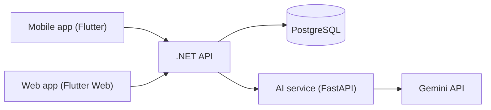

# Architecture

## Who talks to whom

| From             | To            | How                         |
| ---------------- | ------------- | --------------------------- |
| Mobile / Web     | Backend       | REST (JSON) over HTTP       |
| Backend          | PostgreSQL    | EF Core                     |
| Backend          | AI service    | REST (JSON) over HTTP       |
| AI service       | Gemini        | `google-genai` Python SDK   |

## Key decisions

- **Apps only talk to the backend.** One place for auth, validation and data.
- **Only the AI service holds the Gemini key.** Prompts and model choice live in one place.
- **One repo, one folder per team.** Easy to see everything, CI only runs for the folder you changed.

<!-- Add more decisions here as the project grows (auth method, file storage, etc.) -->
