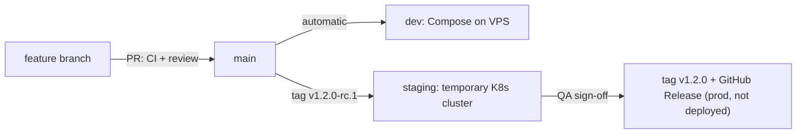

# Branching & Release Rules

**Strategy: GitHub Flow + tag-based promotion.** Read this once; it's short.

## The one rule for developers

> Branch from `main` → open a PR to `main` → CI passes + 1 approval → squash merge.

## Branches

| Branch                 | Purpose                                       | Lifetime            |
| ---------------------- | --------------------------------------------- | ------------------- |
| `main`                 | Always working, always deployable. Protected. | Forever             |
| `<area>/<description>` | Your work, e.g. `mobile/home-screen`          | Hours to a few days |

Areas: `backend`, `frontend`, `mobile`, `ai`, `design`, `infra`, `docs`.
Delete your branch after merging (GitHub does it automatically).

## Environments

| Environment | What it is                          | Created when                       | Lifetime                                  | Used for                         |
| ----------- | ----------------------------------- | ---------------------------------- | ----------------------------------------- | -------------------------------- |
| **dev**     | Docker Compose on the VPS           | Every merge to `main` (automatic)  | Permanent                                 | Teams test against the latest code |
| **staging** | Kubernetes cluster (Terraform + Helm + ArgoCD) | A release candidate tag (`v1.2.0-rc.1`) | Temporary: destroyed after QA finishes | QA tests the release candidate   |
| **prod**    | **Not deployed.** A promoted release | QA signs off → final tag `v1.2.0`   | A GitHub Release + versioned images       | The official, tested version     |

> [!NOTE]
> Prod is deliberately not a running environment in this project. "Promoting to prod" means the release
> candidate that passed QA gets its final version tag and a GitHub Release. The exact images QA tested are
> what's released. Nothing is rebuilt.

## How code travels

Step by step:

1. **Merge to `main`** → images are built and deployed to **dev** (Compose on the VPS). Teams use dev to test against each other's latest work.
2. **DevOps tags a release candidate** (`v1.2.0-rc.1`) on a commit of `main` → the pipeline builds images, creates the **staging** cluster and deploys them with ArgoCD.
3. **QA tests staging.** Bug found? Fix it via a normal PR to `main`, tag `v1.2.0-rc.2`, staging updates (or is recreated).
4. **QA signs off** → DevOps tags the **same commit** `v1.2.0`. The pipeline retags the already-tested images as `v1.2.0` and creates the GitHub Release. This is the promotion to prod.
5. **The staging cluster is destroyed** (automatically after promotion, or after a timeout, e.g. 24 hours) to save cloud credits.

## What keeps broken code from being released (layers)

1. **PR gate (before merge).** The required check `CI passed` runs lint, tests and builds each changed
   folder's Docker image, and starts the whole stack to check `/health`. Red CI = the merge button is disabled.
   Nobody can bypass it, admins included.
2. **Review.** 1 approval from the folder owner ([CODEOWNERS](../.github/CODEOWNERS)).
3. **Up to date.** The branch must be up to date with `main` before merging, so what was tested is what lands.
4. **Dev.** Every merge auto-deploys to dev. If dev breaks, **fixing it is the top priority**
   (revert the PR first, debug later). This keeps `main` releasable.
5. **Staging + QA.** A release candidate only becomes a release after QA tests it on staging and signs off.

> [!NOTE]
> CI can't test everything, and nothing guarantees zero bugs. That's why QA exists: staging is the
> last check before a version is declared released.

## QA sign-off

- QA tests the release candidate on staging (manual testing + any automated end-to-end tests).
- QA reports bugs as GitHub issues, labelled with the version (e.g. `v1.2.0-rc.1`).
- When done, QA **explicitly approves in writing** (a comment on the release issue, or an approval on the
  `staging` GitHub Environment). Only then does DevOps push the final tag.
- No sign-off = no final tag.

## Releases (DevOps / lead)

- Versions follow `vMAJOR.MINOR.PATCH` (e.g. `v1.2.0`).
- Release candidate: tag `main` as `v1.2.0-rc.1`. Found a bug? Fix via normal PR, tag `rc.2`.
- Release: tag **the same commit** that passed QA as `v1.2.0`. Never tag a different commit.

## Hotfix (a released version has a serious bug)

1. Branch from `main`: `backend/fix-login-crash` → PR → merge (same CI rules, no shortcuts).
2. Tag `v1.2.1-rc.1` → QA checks it on staging → tag `v1.2.1`.

## Commit & PR rules

- **Squash and merge** only, so `main` history stays clean (one commit per PR).
- PR title format: `area: what changed` (e.g. `backend: add login endpoint`).
- Keep PRs small (< ~400 lines). Big PRs get slow reviews and hide bugs.
- Changed an endpoint? Update [`docs/api/`](api/) in the same PR.
- Don't merge your own PR without a review. Don't push to `main`. Never `--force` push shared branches.
- Unfinished feature? Merge it **disabled** (feature flag / unreachable screen) rather than keeping a long-lived branch.

---

## Setup checklist for the repo admin (GitHub → Settings)

> [!NOTE]
> The `CI passed` check only appears in GitHub's list after DevOps has created the CI workflow and it has run
> once (see the CI spec in [infra/README.md](../infra/README.md)). Do the rest of this checklist first, add that check after.

**Branches → Add ruleset for `main`:**

- [ ] Require a pull request before merging
  - [ ] Required approvals: **1**
  - [ ] Dismiss stale approvals when new commits are pushed
  - [ ] Require review from Code Owners
  - [ ] Require conversation resolution
- [ ] Require status checks to pass → add **`CI passed`** (and nothing else)
  - [ ] Require branches to be up to date before merging
- [ ] Block force pushes
- [ ] Restrict deletions
- [ ] Do **not** add bypass permissions for anyone
- [ ] Require linear history

**General → Pull Requests:** enable _Squash merging_ only, enable _Automatically delete head branches_.

**Environments (Settings → Environments):** create `dev` and `staging`.
On `staging` add **Required reviewers** (QA lead) so the sign-off is recorded in GitHub.

**Tag protection:** restrict creating `v*` tags to DevOps/leads.
